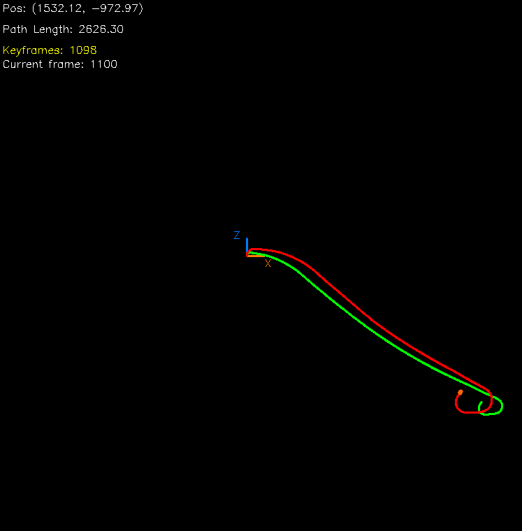
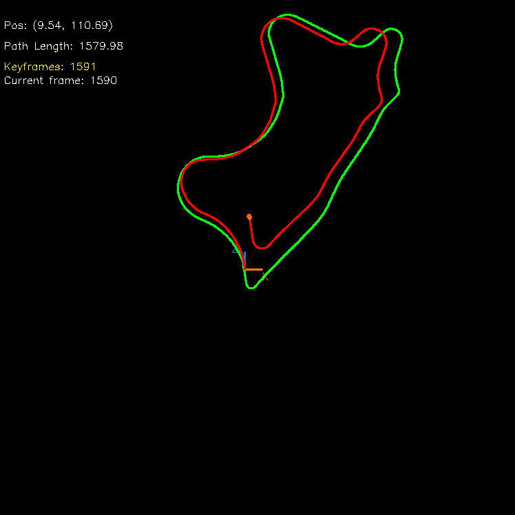

# Visual Odometry on KITTI Dataset

A monocular visual odometry system that estimates camera trajectory in real-time using feature-based motion estimation. This project tracks camera movement through sequential images from the KITTI dataset, computing the 2D path traveled in the XZ plane.

## Demo


*Real-time trajectory estimation showing feature matching (top) and estimated path vs. ground truth (bottom)*

## Overview

Visual odometry (VO) is the process of determining a camera's position and orientation by analyzing the sequence of images it captures. This implementation uses classical computer vision techniques to track distinctive features between consecutive frames and estimate the camera's motion, building up a trajectory over time.

The system processes KITTI autonomous driving dataset sequences, extracting and matching visual features to compute frame-to-frame motion. The estimated trajectory is compared against GPS ground truth to evaluate accuracy.

## How It Works

The visual odometry pipeline consists of several sequential stages:


### 1. Data Loading
Images are loaded from the KITTI dataset along with ground truth poses from GPS/IMU data. The system supports multiple sequences with different characteristics (urban, highway, etc.).

### 2. Feature Detection (Offline Preprocessing)
Before running the main algorithm, distinctive keypoints are detected in all images using SIFT (Scale-Invariant Feature Transform). This computationally expensive step is done once and saved to disk, dramatically reducing runtime during trajectory estimation.

**Why precompute?** Feature detection is the slowest part of the pipeline. By computing features offline and storing them, the main program can run in near real-time, making it practical for visualization and experimentation.

### 3. Feature Matching (Real-time)
For each pair of consecutive frames, the system:
- Loads precomputed features from disk
- Matches keypoints between frames using descriptor similarity
- Applies ratio test and geometric verification to filter outliers

### 4. Motion Estimation (Real-time)
Using matched feature correspondences, the system:
- Computes the Essential Matrix using RANSAC (outlier rejection)
- Recovers relative rotation (R) and translation (t) between frames
- Filters matches based on inlier count and translation magnitude

### 5. Pose Integration
The frame-to-frame motions are accumulated to build the complete trajectory. A scale recovery step adjusts the relative scale (monocular vision is scale-ambiguous) using ground truth or heuristics.

### 6. Visualization
The system displays:
- **Top panel**: Side-by-side camera images with matched features
- **Bottom panel**: Overhead view of estimated trajectory (red) vs. ground truth (green)

## Results

The system successfully tracks camera motion across different KITTI sequences with varying environmental conditions:

**Sequence 00 - Urban Environment:**


**Sequence 01 - Highway Environment:**


**Sequence 09 - Suburban/Urban Mixed:**


The estimated trajectories (red) closely follow the ground truth paths (green) across all sequences, demonstrating robust feature tracking and motion estimation through different scenarios including sharp turns, highway driving, and mixed urban/suburban environments.

**Key Performance Characteristics:**
- Real-time processing after feature preprocessing (30+ FPS)
- Robust feature matching with RANSAC outlier rejection
- Keyframe selection strategy for improved stability
- Handles sequences of 1000+ frames
- Accurate tracking across diverse road conditions

## Installation

### Requirements
- Python 3.7+
- OpenCV with contrib modules (for SIFT)
- NumPy, h5py for data handling

### Setup

1. **Clone the repository:**
   ```bash
   git clone https://github.com/yourusername/Visual_Odometry.git
   cd Visual_Odometry
   ```

2. **Install dependencies:**
   ```bash
   pip install opencv-contrib-python numpy h5py
   ```

3. **Download KITTI dataset:**
   
   Download the odometry dataset from [KITTI Vision Benchmark](http://www.cvlibs.net/datasets/kitti/eval_odometry.php):
   - Grayscale image sequences (left camera)
   - Ground truth poses
   - Camera calibration files

   Extract into the following structure:
   ```
   Visual_Odometry/
   ├── Images/
   │   ├── 00/
   │   │   ├── image_0/        # Grayscale images
   │   │   └── calib.txt        # Camera calibration
   │   ├── 01/
   │   ├── 03/
   │   ├── 05/
   │   ├── 09/
   │   └── poses_ground_truth/
   │       ├── 00.txt
   │       ├── 01.txt
   │       └── ...
   ```

   **Note:** The image sequences are several gigabytes. This repository does NOT include the dataset - you must download it separately.

## Usage

### Step 1: Precompute Features (One-time setup)

Before running visual odometry, extract and save features for all sequences:

```bash
python feature_detector.py
```

This will:
- Process all available KITTI sequences (00, 01, 03, 05, 09)
- Extract SIFT features from each image
- Save keypoints and descriptors to HDF5 files (`Sequence XX features SIFT.h5`)

**This step takes time** (10-30 minutes depending on hardware) but only needs to be done once. The generated `.h5` files enable real-time performance later.

### Step 2: Run Visual Odometry

```bash
python main.py
```

The program will:
1. Load a sequence (default: sequence 09)
2. Load precomputed features from disk
3. Process image pairs in sequence
4. Display real-time visualization
5. Generate final trajectory plot

**Controls:**
- Press `ENTER` at start to begin processing
- Press `L` to toggle feature correspondence lines
- Press `ESC` to exit

### Customization

**Change sequence** (in `main.py`):
```python
dataset_num = 9  # Options: 0, 1, 3, 5, 9
```

**Adjust processing rate** (in `main.py`):
```python
rate = 10  # Process every 10th frame (1 Hz from 10 Hz original)
```

**Modify keyframe selection** (in `main.py`):
```python
min_inliers = 50        # Minimum feature matches for reliable estimation
min_translation = 0.65  # Minimum motion to accept new keyframe
```

## Technical Details

### Feature Detection
- **Algorithm:** SIFT (Scale-Invariant Feature Transform)
- **Parameters:** 2000 features per image, contrast threshold 0.03
- **Preprocessing:** CLAHE contrast enhancement, Gaussian blur

### Feature Matching
- **Matcher:** FLANN-based (for large feature sets) or Brute-Force
- **Filtering:** Lowe's ratio test (0.7 threshold) + fundamental matrix RANSAC

### Motion Estimation
- **Method:** 5-point Essential Matrix with RANSAC
- **Camera model:** Calibrated pinhole (intrinsics from KITTI)
- **Output:** Rotation matrix R and translation vector t (up to scale)

### Pose Integration
- Accumulated rotation: R_total = R_i^T @ R_total
- Accumulated translation: t_total = t_total + scale * (R_total @ t_i^T)
- Scale factor: Tuned per sequence based on empirical results

## Project Structure

```
Visual_Odometry/
├── main.py                    # Main visual odometry pipeline
├── motion_plot.py             # Trajectory visualization
├── feature_detector.py        # Offline feature extraction
├── image_processing.py        # Data loading and feature utilities
├── Images/                    # KITTI dataset (not included)
│   ├── 00/, 01/, 03/, ...     # Sequence folders
│   └── poses_ground_truth/    # Ground truth poses
├── results/                   # Output images and videos
├── project_plan.png           # Pipeline diagram
└── README.md
```

## Performance Notes

**Why preprocessing matters:**
- **Without preprocessing:** ~2-5 FPS (feature detection bottleneck)
- **With preprocessing:** 30+ FPS (only matching and motion estimation)

The offline feature extraction step makes interactive experimentation practical, allowing rapid testing of different matching and motion estimation parameters.

## Limitations & Future Work

**Current limitations:**
- Scale ambiguity requires manual tuning per sequence
- Drift accumulates over long sequences (no loop closure)
- Sensitive to low-texture scenes (feature detection dependent)

**Potential improvements:**
- Add bundle adjustment for global optimization
- Implement loop closure detection
- Use stereo camera for absolute scale recovery
- Integrate IMU data for improved motion estimates

## References

- [KITTI Vision Benchmark Suite](http://www.cvlibs.net/datasets/kitti/)
- [SIFT: Distinctive Image Features from Scale-Invariant Keypoints](https://www.cs.ubc.ca/~lowe/papers/ijcv04.pdf)
- [Multiple View Geometry in Computer Vision (Hartley & Zisserman)](https://www.robots.ox.ac.uk/~vgg/hzbook/)

## Course Information

This project was developed for the Computer Vision course at the University of Oslo (UiO).

## License

This project is open source and available under the MIT License.