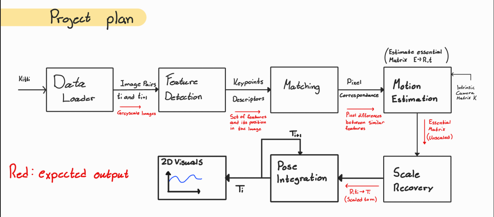

# Visual_Odometry
Visual odometry for the computer vision course at UiO

# How to:
This repository consists of the code and the images used for VO. If cloned, the images will be downloaded, which is a few gigabytes. In order to run the VO porgram, we suggest first running feature_detector.py. The feature detection algorithm has been moved to feature_detector.py for offline computation. This script precomputes and saves all keypoints and descriptors, so when the main script is run, feature extraction does not need to be repeated. This significantly reduces runtime, especially on hardware with limited processing power.
After this, the main program can be run as normal. 
